<p align="center">
  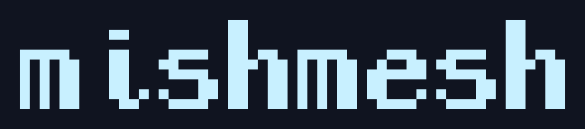
</p>

<p align="center"><b>Standalone companion firmware for MeshCore radios.</b></p>

<p align="center">
  <a href='https://ko-fi.com/W3V222VPDT' target='_blank'></a>
</p>

This is a fork of [MeshCore](https://github.com/meshcore-dev/MeshCore) that adds
**mishmesh**, a standalone user interface. MeshCore's companion
firmware normally leans on a paired phone for most things; mishmesh
puts messaging, contacts, and configuration on the device, so the radio is
useful on its own and the phone is optional. It can currently do almost everything
without a phone.

It currently targets Wio Trackler L1 (pro).
E-ink support will be there at some point, I currently don't have a device to test it.
In theory we can support more devices with enough buttons.

The underlying MeshCore firmware is mostly unchanged; see [About MeshCore](#about-meshcore)
below.

### Screens

<table>
  <tr>
    <td align="center">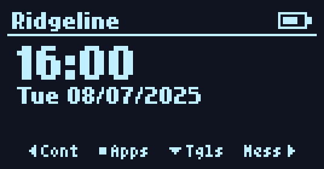<br><sub>Home</sub></td>
    <td align="center">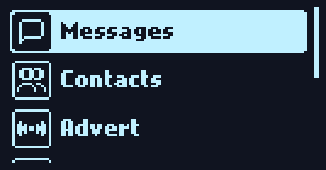<br><sub>App menu</sub></td>
    <td align="center">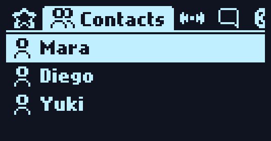<br><sub>Contacts</sub></td>
  </tr>
  <tr>
    <td align="center">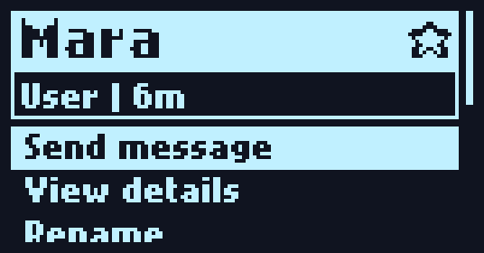<br><sub>Contact detail</sub></td>
    <td align="center">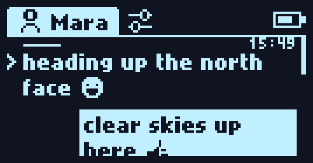<br><sub>Conversation</sub></td>
    <td align="center">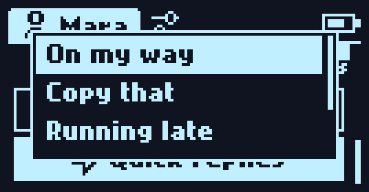<br><sub>Quick replies</sub></td>
  </tr>
  <tr>
    <td align="center">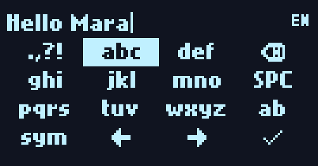<br><sub>Keypad</sub></td>
    <td align="center">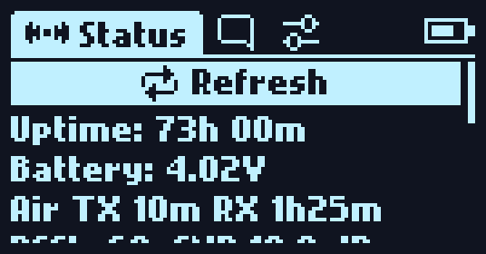<br><sub>Repeater status</sub></td>
    <td align="center">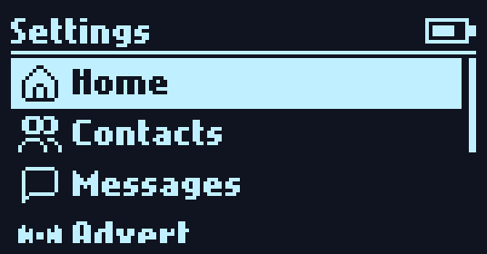<br><sub>Settings</sub></td>
  </tr>
  <tr>
    <td align="center">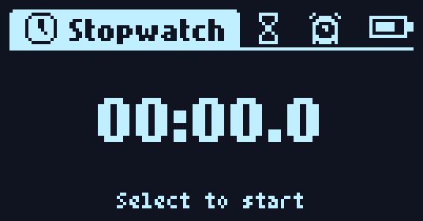<br><sub>Stopwatch</sub></td>
    <td align="center">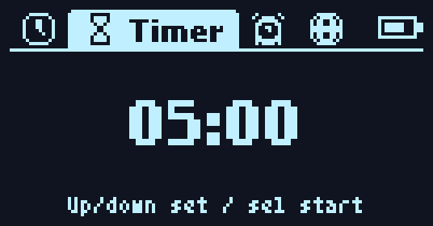<br><sub>Timer</sub></td>
    <td align="center">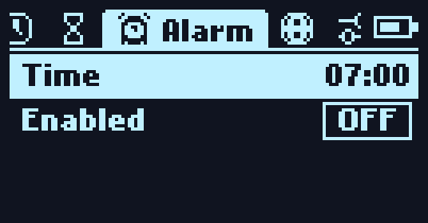<br><sub>Alarm</sub></td>
  </tr>
  <tr>
    <td align="center">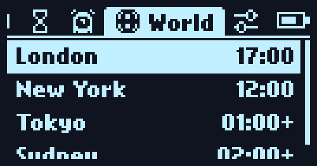<br><sub>World clock</sub></td>
    <td></td>
    <td></td>
  </tr>
</table>

### mishmesh features

- **Messaging** - direct messages, channels, and room servers, with delivery
  status, auto-retry, and path reset when a route goes stale.
- **Contacts** - favourites and per-kind tabs (people, repeaters, rooms),
  rename, ping, telemetry requests, and path management.
- **Repeater management** - log in to a repeater and configure it from the
  device: settings, access list, neighbours, region.
- **Clock** - stopwatch, timer, alarm, and a world clock with DST-aware
  timezones.
- **Airtime** - live duty-cycle and airtime usage against the TX budget.
- **Adverts and sharing** - send adverts and share contacts/channels as QR.
- **Settings on-device** - radio config (frequency, bandwidth, spreading
  factor, TX power), screen sleep, sound, and timezone.
- **First-boot onboarding** - a short wizard for name, region, and time.

### Install

Grab the latest `WioTrackerL1_companion_radio_*_mishmesh-*.uf2` from
[Releases](../../releases), then:

1. Plug the Wio Tracker L1 into USB.
2. Double-tap reset. It mounts as a USB drive.
3. Drop the `.uf2` onto it. It reboots into mishmesh.

The `ble` build pairs with the phone/web app over Bluetooth; the `usb` build
talks over USB serial. Either way the device is fully usable on its own.

Or [build it yourself](#building-from-source).

### Building from source

A PlatformIO project. With the repo cloned:

```sh
export FIRMWARE_VERSION=mishmesh-dev
pio run -e WioTrackerL1_companion_radio_usb_mishmesh -t upload   # or _ble_mishmesh
```

Package the `.uf2` / `.zip` like a release does (lands in `out/`):

```sh
export FIRMWARE_VERSION=mishmesh-dev
sh build.sh build-firmware WioTrackerL1_companion_radio_usb_mishmesh
```

### Emoji

Emoji use the [EmojiMania](https://idanro.itch.io/emojimania) glyph set - a
purchased license that doesn't allow redistributing the art. So the glyphs live
outside this repository and are compiled in only for the official release builds.
Building from source, or any fork, is fully supported and looks identical, except
emoji render as a placeholder block instead of the glyph.

### How mishmesh fits

The framework lives under [`mishmesh/`](./mishmesh); a thin adapter in
[`examples/companion_radio/ui-mishmesh/`](./examples/companion_radio/ui-mishmesh)
bridges it to the companion app without touching `main.cpp`. Screens are `Applet`
subclasses on a fixed stack managed by `AppletHost`; all drawing goes through
`Canvas`. Text and icons are bitmap fonts rendered with mcufont (Nokia Cellphone
FC, Tom Thumb, Pixelarticons); the logo wordmark is set in the LastPriestess pixel
font by Christina Antoinette Neofotistou.

### AI disclosure

It's mixed. I use AI a lot at work. Side projects are a way for me to keep my
programming skills alive. This project contains a mix of manually written and AI
generated (but manually reviewed) code. I used it more heavily in brainstorming
ideas and discovering the original codebase. Don't use this if you're a purist.

---

## About MeshCore

mishmesh is a fork of **MeshCore**, a lightweight, portable C++ library for
multi-hop packet routing over LoRa and other packet radios. The mesh core, the
companion firmware, supported hardware and the flasher, the phone/web apps, and the
protocol documentation all come from that project. For anything about MeshCore
itself, see the upstream repository:

**https://github.com/meshcore-dev/MeshCore**

## License

MIT, the same as MeshCore.
